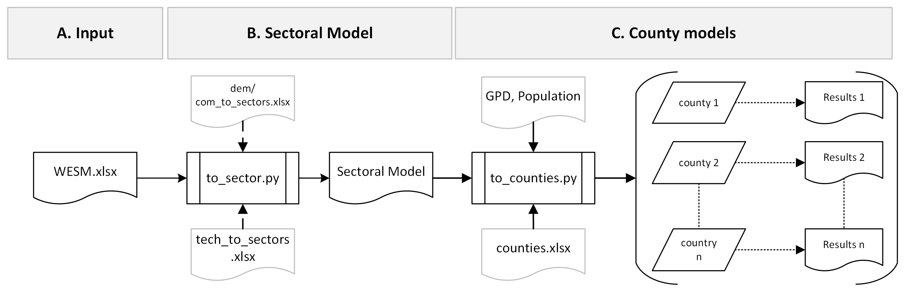

.. _data:

================
Model input data
================

The input data file is the Kenya Whole Energy System Model `(WESM) <https://osemosys-kenya-wesm.readthedocs.io/en/latest/>`_. This a linear optimization model of Kenya's entire energy system developed using OSeMOSYS. It offers a detailed overview of the power and major energy-demanding sectors, including agriculture, commerce, industry, residential, and transportation.

Implementing the disaggregation of a national dataset, such as the WESM, to the county level requires specific county-level data across various sectors. A hierarchy of data sources is proposed, prioritized as follows:

   - **Source 1**: Existing data from county plans and administrations (highest priority).
   - **Source 2**: County-level datasets from national providers (e.g., population data from KNBS).
   - **Source 3**: National datasets downscaled to county level (lowest priority), to be used when higher sources are unavailable.

Model Disaggregation and Data Downscaling
==========================================

The following section summarizes the disaggregating process from a national to county-resolved dataset and details how to run the associated Python scripts.

   Diagramme showing Country-to-County disaggregation and data downscaling

Overview
--------
The disaggregation and downscaling process involves three main steps:

- **Box A: National Model**
  - The initial CORE-WESM dataset is stored in an (*.xlsx) file containing all parameters, sets, and commodities representing the model at a national scale. This (*.xlsx) file is obtained by converting the WESM.txt into Excel Data called WESM.xlsx:

   .. code-block:: bash
      
      otoole convert datafile excel wesm.txt wesm.xlsx config.yaml

   Alternatively, the workflow provides a Python script that converts the data from a text file to an Excel file.

   .. code-block:: bash

      python A_convert_national_model.py

- **Box B: Sector-specific Disaggregation**
  - The script ``to_sector.py`` processes the  initial CORE-WESM dataset (WESM.xlsx) and disaggregates it into sector-specific Excel files.
  - **Outputs include:**
    - **Sectoral Files:** One file per sector (e.g., Agriculture.xlsx, Electricity.xlsx) with disaggregated data.
    - **Set.xlsx:** Consolidates set-related data.
    - **Emission.xlsx:** Contains emission-related data.
    - **Other.xlsx:** Stores data not fitting into specific sector mappings.

- **Box C: County-level Downscaling**
  - The script ``to_counties.py`` processes the sectoral files to generate county-resolved datasets.
  - **Key functions:**
    - Allocates the residential sector using population data from ``counties_population_KNBS.csv``. Population by county available in [1]_.
    - Scales sectors like agriculture and services using gross county product (GCP) by economic activity. The Kenya    National Bureau of Statistics (KNBS) offers this information annually based on economic activity and, most importantly, at the county level [2]_.
  - **Outputs include:**
    - **County Folders:** Each contains sector-specific data tailored to county characteristics.
    - **National Folder:** Updated with non-disaggregated data to maintain consistency.

Running the Python Files
------------------------
To execute the disaggregation and downscaling scripts, follow these steps:

**Run the Sector-specific Disaggregation script:**

   .. code-block:: bash

      python B_convert_to_sector.py

**Run the County-level Downscaling Script:**

   .. code-block:: bash

      python C_convert_to_counties.py

**Run the updated fraction of cooking stove-use with data from the DHS script:**

   .. code-block:: bash

      python D_updated_DHS_to_counties.py

**Run the copy multiscale folder script:**

   .. code-block:: bash

      python E_copy_multiscale.py

Additional Details
------------------
- The initial downscaling approach uses GDP and population metrics to create county-resolved datasets.
- Detailed county-level data, such as Gross County Product (GCP) by economic activity from KNBS, can further refine the model by capturing sector-specific contributions (e.g., comparing agriculture in Nairobi vs. Meru).

.. [1] KNBS, “2023 GROSS COUNTY PRODUCT,” Kenya National Bureau of Statistics, 2023, Accessed: Mar. 05, 2025. [Online]. Available: https://www.knbs.or.ke/wp-content/uploads/2023/10/GCP-report-2023.pdf
.. [2] KNBS, Kenya National Bureau of Statistics, 2023, Accessed: Mar. 05, 2025. [Online]. Available: https://www.knbs.or.ke

