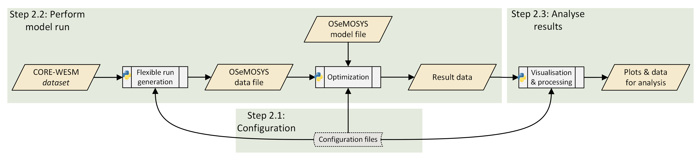

.. _model:

=================
Model application
=================

A complete set up of CORE-WESM includes three different elements,

- the input data set,
- an OSeMOSYS model file, and
- a `Python`_-based workflow script along with two configuration files in YAML language.

The input data set is generated in the first step of the workflow described in :ref:`data`. The OSeMOSYS model file is provided in the model repository, along with the workflow script and default versions of the configuration files.

Running the model entails three different steps, which are further explained in the sections below:

1. Setting up the configuration files defining workflow and model run
2. Performing CORE-WESM runs
3. Analysing model results

An overview of the workflow and data flows is provided in Figure below. A more conceptual description of the workflow can be found in a `preprint`_.

   Diagramme showing the run workflow of CORE-WESM. The figure is adopted from this `preprint`_.

Configuration of workflow and run
=====================================

The configuration of the workflow and model is based on two configuration files in YAML format, the data (``data_config.yaml``) and workflow (``workflow_config.yaml``) configuration files. 

The data configuration file lists the sets and parameters and relevant specifications, e.g., data types. The format is similar to config files used for the OSeMOSYS processing library `otoole`_. A data configuration file is provided in the model repository and only needs to be updated if the model structure is amended. An excerpt of the config file is shown below.

.. literalinclude:: ../src/core_wesm/config_files/data_config.yaml
  :language: YAML
  :lines: 16-25

The workflow configuration file needs to be updated to the local model setup, and to define the required model runs. The model repository includes a default workflow config file with a description of each of the parameters. The file is also shown in full below.

.. literalinclude:: ../src/core_wesm/config_files/workflow_config.yaml
  :language: YAML

Performing model runs
=========================

The configuration files described above are defining how the workflow script (``CORE-WESM_workflow.py``) is executed. The script makes use of a Python module (``ospro.py``) with a number of relevant processing functions. It is also based on the compact multi-scale modelling framework `fratoo`_. The workflow script can be used as is for the entire workflow or certain steps, e.g., up until the generation of a OSeMOSYS datafile. It can also be the basis for further development or for a completely redeveloped workflow that could also directly build on the fratoo framework.

The workflow script includes the following steps:

1. Loading and processing input data files
    - This includes, e.g., the temporal aggregation of the model to reduce the computational complexity introduced through the spatial disaggregation.
2. Initializing the multi-scale structure and generate run data
    - This builds on the fratoo framework. Runs can be generated, e.g., for a single county, all counties aggregated, or a full run with all counties represented explicitely.
    - This generates an OSeMOSYS datafile in the GNU Mathprog syntax.
3. Performing the optimization of the model run
    - This first generated an LP file using GLPK, and the optimizes using cbc or HiGHS solver.
4. Processing and saving results data
    - This also includes initial results visualization. 

The script can be run as follows

   .. code-block:: bash

      python CORE-WESM_workflow.py

Results analysis
====================

Based on the focus or research question at hand, an analysis of the modelling results can be performed. The workflow script includes initial plotting functions that can be extended, or a separate processing or plotting of results data can be performed for more comprehensive analyses (e.g., using spreadsheet software.

.. 
    note::
    This is the main page of your project's `Sphinx`_ documentation.
    It is formatted in `reStructuredText`_. Add additional pages
    by creating rst-files in ``docs`` and adding them to the `toctree`_ below.
    Use then `references`_ in order to link them from this page, e.g.
    :ref:`authors` and :ref:`changes`.
    It is also possible to refer to the documentation of other Python packages
    with the `Python domain syntax`_. By default you can reference the
    documentation of `Sphinx`_, `Python`_, `NumPy`_, `SciPy`_, `matplotlib`_,
    `Pandas`_, `Scikit-Learn`_. You can add more by extending the
    ``intersphinx_mapping`` in your Sphinx's ``conf.py``.
    The pretty useful extension `autodoc`_ is activated by default and lets
    you include documentation from docstrings. Docstrings can be written in
    `Google style`_ (recommended!), `NumPy style`_ and `classical style`_.
.. _fratoo: https://fratoo.readthedocs.io/en/latest/
.. _Python: https://docs.python.org/
.. _preprint : https://zenodo.org/
.. _otoole : https://otoole.readthedocs.io/en/latest/
