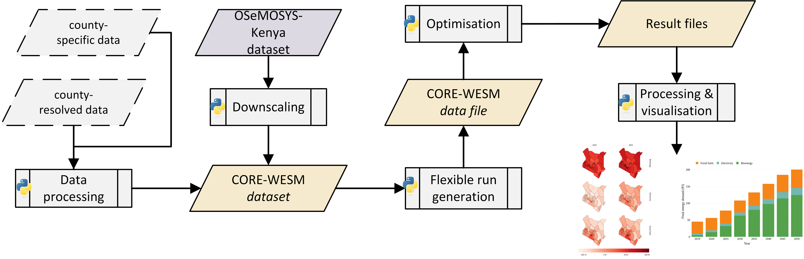

.. _model:

=================
Model application
=================

A complete set up of CORE-WESM includes three different elements,

- the raw input data,
- an OSeMOSYS model file, and
- `Python`_-based workflow scripts along with configuration files in YAML language.

The input data and the OSeMOSYS model file are provided in the model repository, along with the workflow scripts and default versions of the configuration files.

Running the model entails four different steps:

1. Setting up the configuration files defining workflow and model run
2. Processing the raw input data to generate a model input data set
3. Performing CORE-WESM runs
4. Analysing model results

These steps are further explained in the sections below.

An overview of the workflow and data flows is provided in Figure below.
:ref:`data`

   Diagramme showing the run workflow of CORE-WESM. The figure is adopted from this `preprint`_.

Configuration of workflow and run
==================================

The configuration of the workflow and model is based on five configuration files in YAML format, which includes data (``config_CORE-WESM.yaml`` and ``config_OSeMOSYS_Kenya.yaml``) and workflow (``run.yaml``, ``analysis_config_X.yaml`` and ``pipeline_config.yaml``) configuration files. 

The data configuration files list the sets and parameters and relevant specifications, e.g., data types, for the national OSeMOSYS Kenya model as well as CORE-WESM. The format is similar to config files used for the OSeMOSYS processing library `otoole`_. A data configuration file is provided in the model repository and only needs to be updated if the model structure is amended. An excerpt of ``config_CORE-WESM.yaml`` is shown below.

.. literalinclude:: ../src/core_wesm/config_files/config_CORE-WESM.yaml
  :language: YAML
  :lines: 16-25

The workflow configuration files need to be updated to the local model setup, and to define the required model runs. The model repository includes default workflow config files. The files are also shown in full below.

``pipeline_config.yaml`` defines the general model setup, in particular also filepaths:

.. literalinclude:: ../src/core_wesm/config_files/pipeline_config.yaml
  :language: YAML

``run.yaml`` sets the analyes, i.e., model runs, to be performed:
.. literalinclude:: ../src/core_wesm/config_files/run.yaml
  :language: YAML

``analysis_config_KNeCS.yaml`` defines an analysis setup, e.g., scenarios and spatial configuration to be used for model runs:
.. literalinclude:: ../src/core_wesm/config_files/analysis_config_KNeCS.yaml
  :language: YAML

Processing input data and performing model runs
===============================================

The configuration files described above are defining how the workflow script (``workflow.py``) is executed. The script makes use of workflow functions defined in a separate script, based on the Python module (``ospro.py``) which includes a number of relevant processing functions. It is also based on the compact multi-scale modelling framework `fratoo`_. The workflow script can be used as is for the entire workflow or certain steps, e.g., up until the generation of a OSeMOSYS datafile. It can also be the basis for further development or for a completely redeveloped workflow that could also directly build on the fratoo framework.

The workflow script includes the following steps:
1. Processing of raw input data (this is further explained in :ref:`data`)
    a. Converting the OSeMOSYS-Kenya data file into a spreadsheet file for processing
    b. Downscaling the model to a county-resolved model
    c. Processing the county-resolved model, in particular to integrate any county-resolved and county-specific data
2. Running the model
    a. Loading and processing input data files
        - This includes, e.g., the temporal aggregation of the model to reduce the computational complexity introduced through the spatial disaggregation.
    b. Initializing the multi-scale structure and generate run data
        - This builds on the fratoo framework. Runs can be generated, e.g., for a single county, all counties aggregated, or a full run with all counties represented explicitely.
        - This generates an OSeMOSYS datafile in the GNU Mathprog syntax.
    c. Performing the optimization of the model run
        - This first generated an LP file using GLPK, and the optimizes using cbc or HiGHS solver.
    d. Processing and saving results data

The script can be run as follows

   .. code-block:: bash

      python workflow.py

Results analysis
====================

Based on the focus or research question at hand, an analysis of the modelling results can be performed. The workflow script does currently not include plotting functions but could be extended in future. Postprocessing or plotting of results data can be performed independently, e.g., using other Python scripts or spreadsheet software.

.. 
    note::
    This is the main page of your project's `Sphinx`_ documentation.
    It is formatted in `reStructuredText`_. Add additional pages
    by creating rst-files in ``docs`` and adding them to the `toctree`_ below.
    Use then `references`_ in order to link them from this page, e.g.
    :ref:`authors` and :ref:`changes`.
    It is also possible to refer to the documentation of other Python packages
    with the `Python domain syntax`_. By default you can reference the
    documentation of `Sphinx`_, `Python`_, `NumPy`_, `SciPy`_, `matplotlib`_,
    `Pandas`_, `Scikit-Learn`_. You can add more by extending the
    ``intersphinx_mapping`` in your Sphinx's ``conf.py``.
    The pretty useful extension `autodoc`_ is activated by default and lets
    you include documentation from docstrings. Docstrings can be written in
    `Google style`_ (recommended!), `NumPy style`_ and `classical style`_.
.. _fratoo: https://fratoo.readthedocs.io/en/latest/
.. _Python: https://docs.python.org/
.. _preprint : https://doi.org/10.5281/zenodo.15115502
.. _otoole : https://otoole.readthedocs.io/en/latest/
